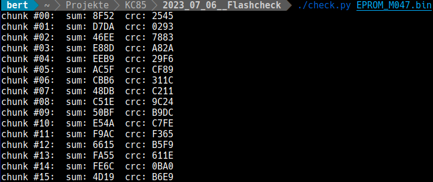
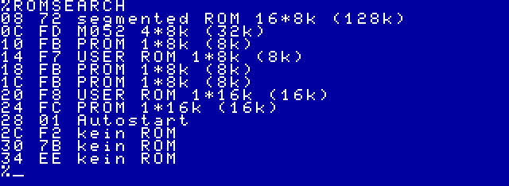
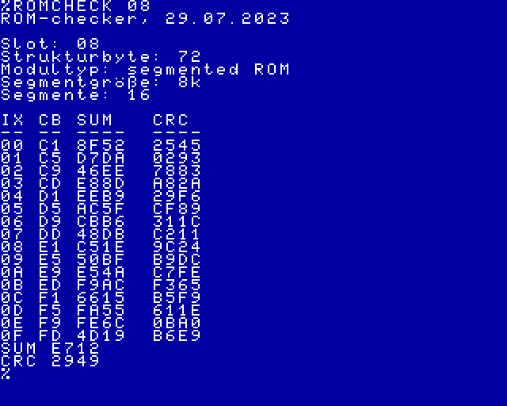
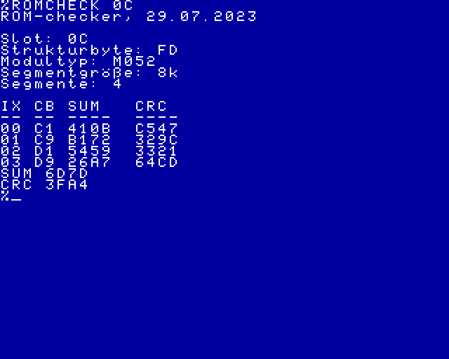

# romcheck.kcc

Mit diesen Werkzeugen lassen sich zu allen ROM-Modulen bzw. Segementen Prüfsummen und CRC ermitteln.

Als einfache Prüfsumme wird die Summe aller 8-Bit Werte (modulo 2^16) erzeugt (SUM16). Der CRC wird nach CRC16-CCITT gebildet.

Zum Vergleich können die Prüfsummen auch von einem Python-Skript für den PC erzeugt werden. 


Das KC85-Programm enthält folgende Programmmodule:
## ROMSEARCH

ROMSEARCH durchsucht den kompletten KC85 (Mühlhausen-KC85/4 oder KC85/5) nach ROM-Modulen. Wird ein Modul gefunden erfolgt die Ausgabe der Schachtnummer, des Strukturbytes und bei ROM-Modulen der Typ und die Größe.



## ROMCHECK

ROMCHECK ermittelt die Prüfsummen über alle Segmente eines Moduls.
Als Parameter wird die Schachtnummer benötigt.

Es erflogt die Ausgabe der Schachtnummer, des Strukturbytes, des Modultypes, sowie von Segmentgröße und Zahl der Segmente.

Beispielausgabe für ein M047 mit 16 ROM Segmenten:



Beispielausgabe für ein M052 mit vier ROM Segmenten:



## SUM
Mit dem Programm SUM läßt sich die einfache Prüfsumme (SUM16) über einen bestimmten Speicherbereich ermitteln.
Als Parameter werden die Startadresse und die Länge benötigt.
Optional läßt sich ein Startwert angeben. Damit läßt sich die Prüfsumme über mehrere Speicherbereiche ermitteln.
Für das Aktivieren der richtigen Speicherbereiche (SWITCH) ist der Anwender verantwortlich.

Das Beispiel erzeugt die Prüfsumme über den RAM-Bereich von 4000h bis 4FFFh:

```
SUM 4000 1000
```

## CRC
Mit dem Programm CRC läßt sich die Prüfsumme (CRC16) über einen bestimmten Speicherbereich ermitteln.
Als Parameter werden die Startadresse und die Länge benötigt.
Optional läßt sich ein Startwert angeben. Damit läßt sich die Prüfsumme über mehrere Speicherbereiche ermitteln.
Für das Aktivieren der richtigen Speicherbereiche (SWITCH) ist der Anwender verantwortlich.

Das Beispiel erzeugt die CRC-Prüfsumme über den ROM-Bereich von C000h bis DFFFh und verwendet als Startwert 55AAh:

```
CRC C000 2000 55AA
```

# Parameter der ROM-Module

Modul | Bezeichnung            | Strukturbyte | Segmentgröße | Segmente | Steuerbyte | Basis | Shift
----- | -----------            | ------------ | ------------ | -------- | ---------- | ----- | -----
M006  | BASIC                  | FC           | 16k          |  1       | AAxxxxxM   | C1    | %
M012  | TEXOR                  | FB           |  8k          |  1       | AAAxxxxM   | C1    | %
M025  | USER PROM 8k           | F7           |  8k          |  1       | AAAxxxxM   | C1    | %
M026  | FORTH                  | FB           |  8k          |  1       | AAAxxxxM   | C1    | %
M027  | DEVELOPMENT            | FB           |  8k          |  1       | AAAxxxxM   | C1    | %
M028  | 16k EPROM              | F8           | 16k          |  1       | AAxxxxxM   | C1    | %
M028  | 16k EPROM              | FC           | 16k          |  1       | AAxxxxxM   | C1    | %
M033  | TYPESTAR               | 01           |  8k          |  2       | AA0SxxxM   | C1    | 4
M040  | USER PROM 16k          | F8           | 16k          |  1       | AAxxxxxM   | C1    | %
M040  | USER PROM 8k           | F7           |  8k          |  1       | AAxxxxxM   | C1    | %
M045  | 32k segmented ROM      | 70           |  8k          |  4       | AASSxxxM   | C1    | 4
M046  | 64k segmented ROM [^1] | 71           |  8k          |  8       | AASSSxxM   | C1    | 3
M047  | 128k segmented ROM     | 72           |  8k          | 16       | AASSSSxM   | C1    | 2
M048  | 256k segmented ROM     | 73           | 16k          | 16       | AASSSSxM   | C1    | 2
M049  | 512k segmented ROM     | 74           | 16k          | 32       | AASSSSSM   | C1    | 1
M052  | USB + Netzwerk         | FD           |  8k          |  4       | AAASSPxM   | C1    | 3

[^1]: Beim Modul M046 müssen statt der Brücken RB02 und RB04 die Brücken RB03 und RB05 gesteckt werden, damit die hier beschriebene Ansteuerung funktioniert.

Um das Steuerbyte für ein bestimmtesROM- Segment zu ermitteln, wird die Segmentnummer um den Betrag Shift nach links verschoben und auf das Basisbyte addiert.

Beispiel: Gesucht wird das Steuerbyte um im Modul M052 das zweite ROM-Segment auf Adresse C000h einzublenden.

Bemerkung              | Binärdarstellung
---------              | ----------------
Segmentnummer 2        | 0000 0010b
Shift um 3 nach links  | 0001 0000b
Basisbyte  0C1h        | 1100 0001b
Addition mit Basisbyte | 1101 0001b --> 0D1h
