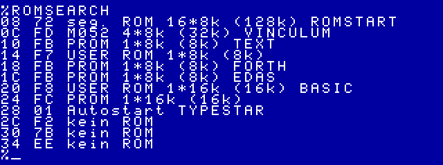
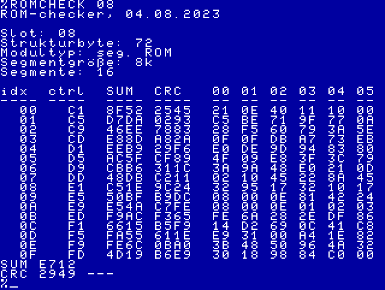

# romcheck.kcc

Mit diesen Werkzeugen lassen sich zu allen ROM-Modulen bzw. Segementen Prüfsummen und CRC ermitteln.

Als einfache Prüfsumme wird die Summe aller 8-Bit Werte (modulo 2^16) erzeugt (SUM16). Der CRC wird nach CRC16-CCITT gebildet.

Zum Vergleich können die Prüfsummen auch von einem Python-Skript für den PC erzeugt werden. 

Das KC85-Programm enthält folgende Programmmodule:
## ROMSEARCH

ROMSEARCH durchsucht den kompletten KC85 (Mühlhausen-KC85/4 oder KC85/5) nach ROM-Modulen. Wird ein Modul gefunden erfolgt die Ausgabe der Schachtnummer, des Strukturbytes und bei ROM-Modulen der Typ und die Größe.

## ROMCHECK

ROMCHECK ermittelt die Prüfsummen über alle Segmente eines Moduls.
Als Parameter wird die Schachtnummer benötigt.

Es erflogt die Ausgabe der Schachtnummer, des Strukturbytes, des Modultypes, sowie von Segmentgröße und Zahl der Segmente.

Beispielausgabe für ein M047 mit 16 ROM Segmenten:

Beispielausgabe für ein M052 mit vier ROM Segmenten:

## SUM
Mit dem Programm SUM läßt sich die einfache Prüfsumme (SUM16) über einen bestimmten Speicherbereich ermitteln.
Als Parameter werden die Startadresse und die Länge benötigt.
Optional läßt sich ein Startwert angeben. Damit läßt sich die Prüfsumme über mehrere Speicherbereiche ermitteln.
Für das aktivieren der richtigen Speicherbereiche ist der Anwender verantwortlich.

## CRC
Mit dem Programm CRC läßt sich die Prüfsumme (CRC16) über einen bestimmten Speicherbereich ermitteln.
Als Parameter werden die Startadresse und die Länge benötigt.
Optional läßt sich ein Startwert angeben. Damit läßt sich die Prüfsumme über mehrere Speicherbereiche ermitteln.
Für das aktivieren der richtigen Speicherbereiche ist der Anwender verantwortlich.

